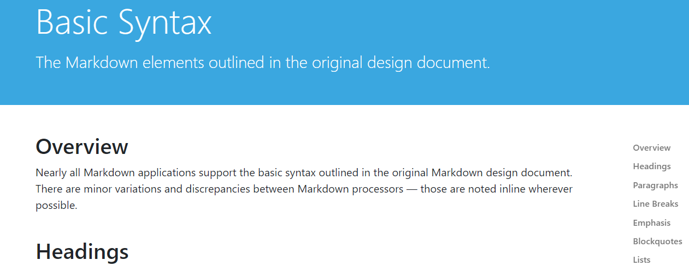

# Da Vinci app basics date: 09-02-23
#### Steps

 - Open davinci -new project -name the project
 
#### Working area:

1. media 
1. cut
1.  colour  
1. edit 
1.  fusion 
1. fairlight 
1. delivery 

## Media
 - Set up project:by clicking right click to import media and then find the video u want to edit 
 - Another way to import media by dragging the folder video to the media pool 

## EDIT

- Edit: drag the primary video to the edit timeline 
- Preview window: u can add another video on side by side
 - Timeline view option: customise the view
 - Edit cut video: drag the play back line and set where you want to delete untill end of the video 
move the cursor backward till the line so ur video could start from there
Click on the blank space and click delete to delete the video that u don't want
 - Blade tool (click b): cut down the clip in different areas mark the Places (there without audio remove the gaps or u don't want the part) 
 - A button is for arrow: click arrow to delete the space u want to buy clicking the gaps And press delete button to delete (without closing the gaps)
 - Shift+delete: removes the clip and closes the gap
 - Ripple edit right contl+shift)
 - Ripple edit lezft  `cntrl+shift`

 

 